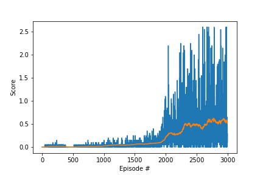

# Learning Algorithm

The algorithm for the agent is [DDPG](https://arxiv.org/pdf/1509.02971.pdf)

* model.py file contains neural network definitions for actor and critic models
* ddpg_agent.py file implements Agent and ReplayBuffer classes
* checkpoint_actor.pth file contains model checkpoint for actor neural network
* checkpoint_critic.pth file contains model checkpoint for critic neural network

Hyperparameters (defined in ddpg_agent.py)

* BUFFER_SIZE = int(1e5)  (replay buffer size)
* BATCH_SIZE = 128        (minibatch size)
* GAMMA = 0.99            (discount factor)
* TAU = 1e-3              (for soft update of target parameters)
* LR_ACTOR = 1e-4         (learning rate of the actor)
* LR_CRITIC = 1e-4        (learning rate of the critic)
* WEIGHT_DECAY = 0        (L2 weight decay)
* UPDATE_EVERY = 1        (how many steps to take before updating target networks)

### Actor neural network

* The Actor neural network consists of three fully connected (FC) layers.
* The input has 24 channels (each agent observes a state with length: 24)
* The output channels of the first FC layer is: 256
* The input and output channels of the second FC layer are: 256, 128
* The input channels of the third FC layer are: 128
* The output has 2 channels (actions: movement toward (or away from) the net, and jumping)

### Critic neural network

* The Critic neural network consists of three fully connected (FC) layers.
* The input has 24 channels (each agent observes a state with length: 24)
* The output channels of the first FC layer is: 256
* The input channels of the second FC layer is: 256 + 2 (actions)
* The output channels of the second FC layer is: 128
* The output has 1 channel

# Plot of Rewards

This chart illustrates the rewards received per episode. We consider the problem solved when the agent reaches at least +0.5 points over 100 episodes. In our case, it took 2700 episodes to achieve this goal.

# Ideas for Future Work

* I would like to use [Tensorboard for PyTorch](https://github.com/lanpa/tensorboardX)
* I would like to spend some time and compare the performance of the agent to [Distributed Distributional Deterministic Policy Gradients (D4PG)](https://openreview.net/forum?id=SyZipzbCb) algorithm
* I would like to compare the performance of the algorthm on CPU vs GPU
* I'm also interested in exploring [Rainbow: Combining Improvements in Deep Reinforcement Learning](https://arxiv.org/abs/1710.02298)
